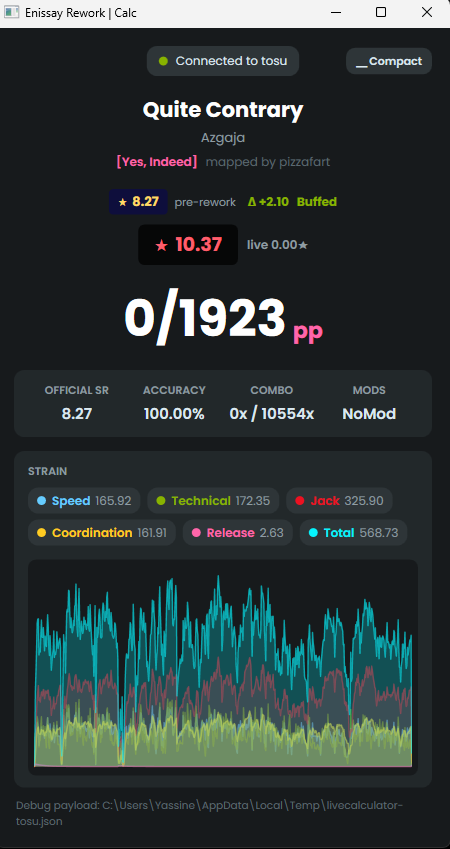
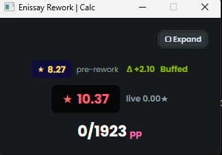

# LiveCalculator

A live visualizer (thanks claude) for the **Enissay rework** (needs the rework's folder though)

It reads the currently played beatmap and gameplay state from [tosu](https://github.com/tosuapp/tosu) over its websocket, runs the local rework calculators, and renders the results (star-rating pill, live PP, per-skill graphs).

## What it does

- Computes SR and live PP using the Enissay rework calculators.
- Visualizes the results live.

## Screenshots

### Expanded mode

### Compact mode

## Running

1. Start osu! and **tosu** (the memory reader) first.
2. Launch LiveCalculator.

Without tosu running, this won't work.
